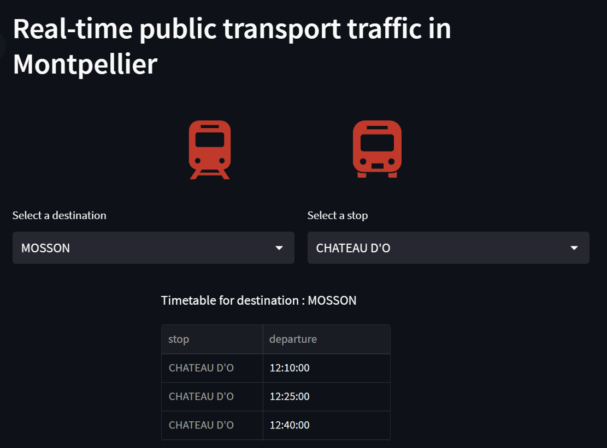

## Streamlit Public Transportation App

 

This repository contains a Streamlit application that provides a modern and user-friendly interface for accessing real-time public transportation data in Montpellier. It allows users to access information such as bus and tram stops, departure times, and destinations.

### Overview of the app

### What is Streamlit ?
Streamlit is an open-source Python library that allows you to create interactive and dynamic web applications for data analysis and visualization. With Streamlit, you can build and deploy data-driven apps quickly and easily, without requiring extensive web development knowledge. It provides a simple and intuitive way to create interactive dashboards, plots, and user interfaces directly from your Python code.

To learn more about Streamlit and how to use it, please refer to the official documentation: [Streamlit Documentation](https://docs.streamlit.io/).

### Deployment
The Streamlit application is available at the following URL: [real-time public transport app](https://mohamedfattouhy-public-transport-app-app-3rn59b.streamlit.app/)

### Getting Started
To run this Streamlit application locally, follow these steps:

1. Clone this repository.
2. Install the required dependencies using `pip install -r requirements.txt` command.
3. Run the Streamlit app using `streamlit run app.py` command.

### Data Source
The application relies on publicly available real-time public transportation data provided by the city of Montpellier. The data includes information about bus and tram destinations, stops, departure times, and more. Data used is available here [dataset](https://data.montpellier3m.fr/dataset/offre-de-transport-tam-en-temps-reel).
